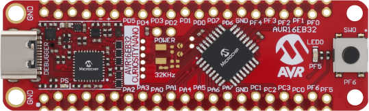
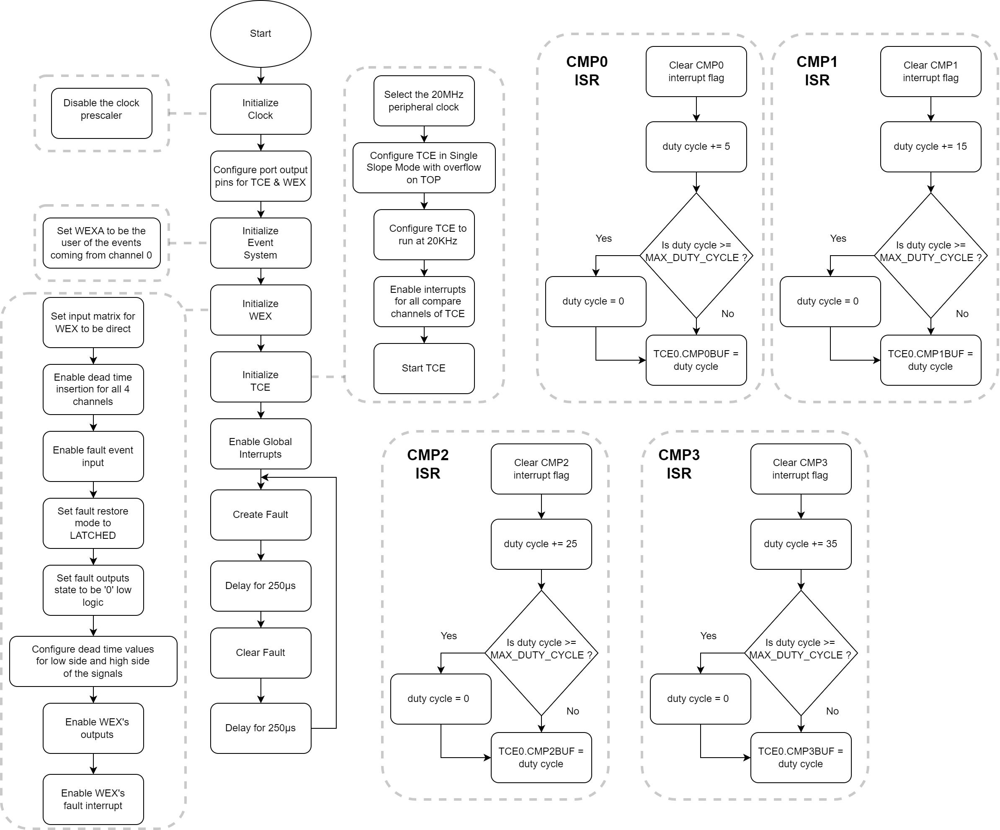
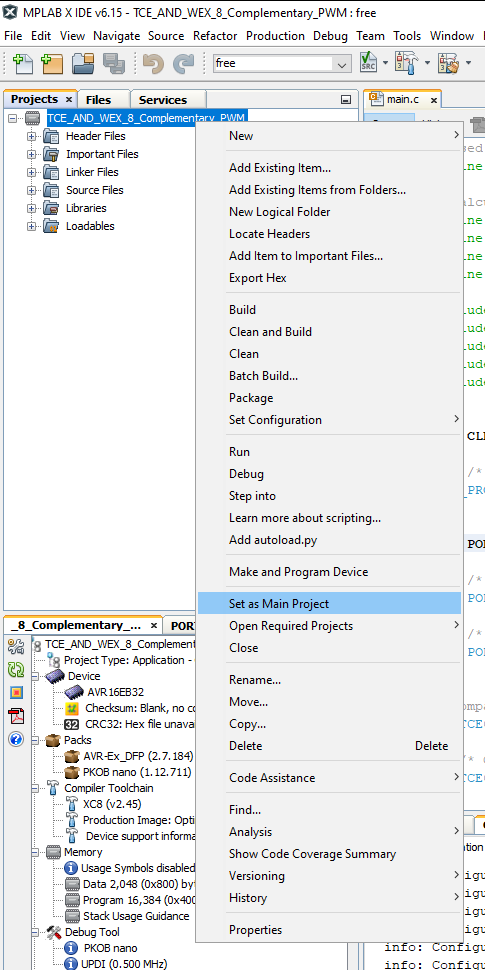
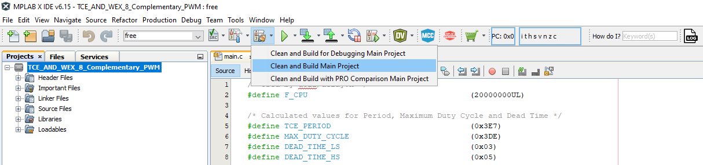
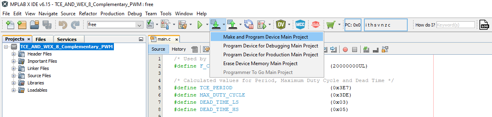
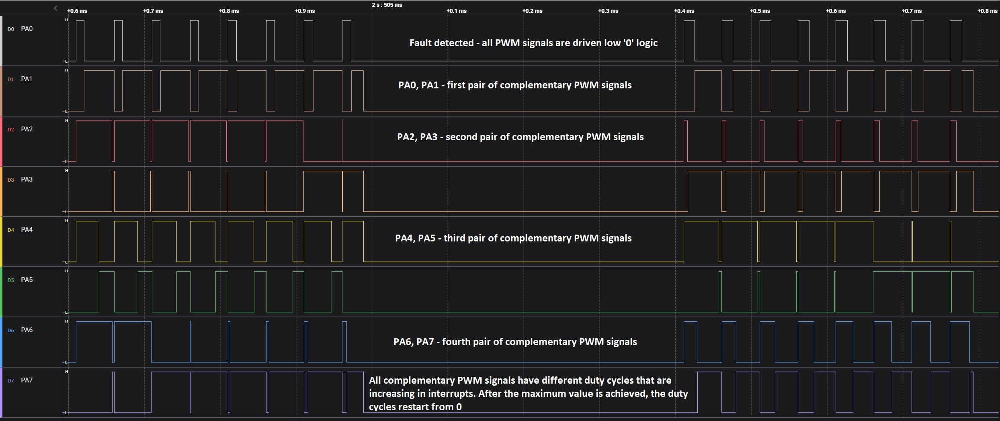

[](https://www.microchip.com)

## Use case 3: Generate Eight Complementary Pulse-Width Modulation Signals Using the TCE and WEX modules

Below is an example of how to set a Timer Counter Type E (TCE) and a Waveform Extension (WEX) instance to generate eight complementary Pulse-Width Modulation (PWM) signals at 20 kHz with a variable duty cycles using the buffering scheme. The signals are in pairs of two and are not overlapping due to the added dead time, a feature which is essential in Motor Control for avoiding the shoot-through current in transistor switching. The update of the Compare registers will happen during the compare match interrupts for each channel. In this example the fault is highlighted as well. When a software event is triggered all the signals are driven low. This happens every 250 μs. To do this, the WEX will be configured for fault detection and the Event System (EVSYS) will be configured to generate a software event. In this example the WEX module is used as a timer extension, not in Pattern Generation mode.

## Related Documentation

More details and code examples on the AVR16EB32 can be found at the following links:

- [AVR<sup>®</sup> EB Product Page](https://www.microchip.com/en-us/product/AVR16EB32)
- [AVR<sup>®</sup> EB Code Examples on GitHub](https://github.com/microchip-pic-avr-examples?q=AVR16EB32)

## Software Used

- [MPLAB® X IDE v6.15 or newer](https://www.microchip.com/en-us/tools-resources/develop/mplab-x-ide)
- [AVR-Ex DFP-2.7.184 or newer Device Pack](https://packs.download.microchip.com/)
- [MPLAB® XC8 compiler v2.45](https://www.microchip.com/en-us/tools-resources/develop/mplab-xc-compilers/downloads-documentation#XC8)

## Hardware Used

- [AVR<sup>®</sup> EB Curiosity Nano](https://www.microchip.com/en-us/product/AVR16EB32)

## Setup

The AVR16EB32 Curiosity Nano Development Board is used as a test platform.

<br>

## Functionality

After the peripheral clock, the output port pins, TCE, WEX, Event System are configured and the global interrupts are enabled, the ```Create_Fault``` and ```Clear_Fault``` functions are called in an infinite loop.
The first function creates a software fault that drives all the output port pins to the low '0' logic. The WEX module's fault handling mechanism is configured in latched mode. Consequently, the fault will be cleared if the fault condition is not active anymore and a software clear command is given. The second function clears the fault and restarts the normal operation of the TCE. First the fault is triggered, then the fault is maintained using a delay of 250 μs. After that delay, the fault is cleared and the TCE works normally for another 250 μs. After that, another fault is triggered and the process repeats itself infinitely. The TCE is configured in Single-Slope mode and runs at 20 KHz. The TCE generates four PWM signals with different duty cycles that are updated in interrupt service routines (ISR). The WEX is configured to be an extension for the TCE and to generate complementary signals with dead time for the ones generated by the TCE. The WEX is also configured to handle faults and the Event System is configured to send software events to the WEX.

## Function that is called in an infinite loop

```c
void Create_Fault(void)
{
    /* Fault creation, repeat in main loop to see it on Logic Analyzer. This is an event generated using a software command */
    EVSYS.SWEVENTA = EVSYS_SWEVENTA_CH0_gc;
}

void Clear_Fault(void)
{
    /* Clear fault condition using a software command */
    WEX0.CTRLC = WEX_CMD_FAULTCLR_gc;
}
```

<br>

## Operation

 1. Connect the board to the PC.

 2. Open the **TCE_AND_WEX_8_Complementary_PWM_MCC.X** or **TCE_AND_WEX_8_Complementary_PWM.X** solution in MPLAB X IDE.

 3. Right click on the project and select **Set as main project**.

<br>

 4. Build the **TCE_AND_WEX_8_Complementary_PWM_MCC.X** or **TCE_AND_WEX_8_Complementary_PWM.X** project: click on **Clean and Build Project**.

<br>

 5. Program the project to the board: click on **Make and Program Device**.

<br>

## Results

A Logic Analyzer capture is illustrated below, to help understand how the WEX generates a complementary waveform signal for each PWM signal generated by the TCE and how the fault handling works in hardware:

<br>The range of the duty cycles is 0-100% of the PERIOD minus the value of dead time added.

<br>

## Summary

This project shows how to use the WEX and TCE to generate complementary PWM signals and how to use the fault feature of the WEX module. Using the TCE and WEX can generate up to eight PWM signals complementary in four independent pairs.