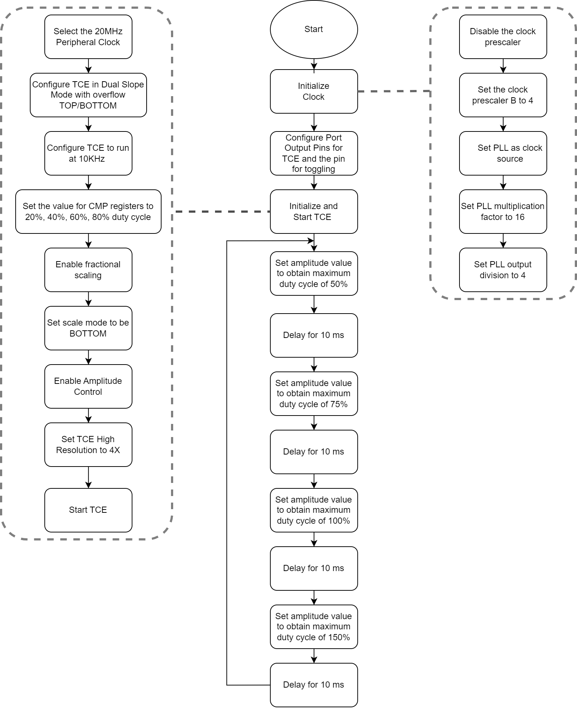
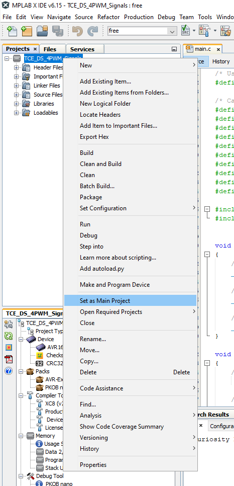
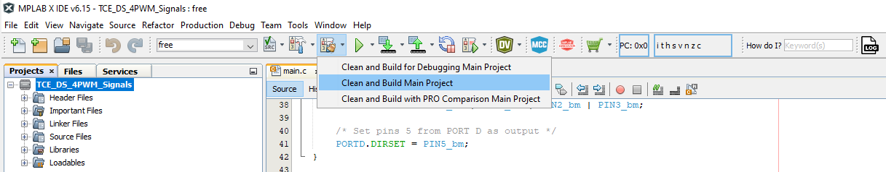
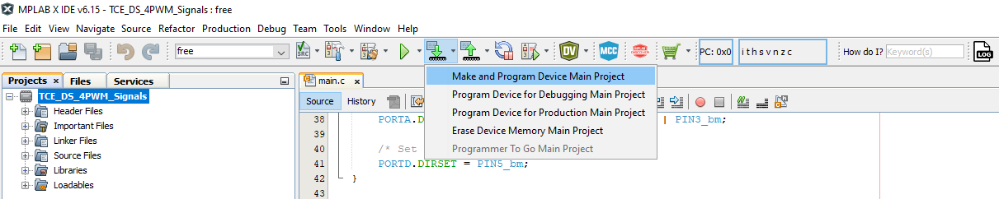
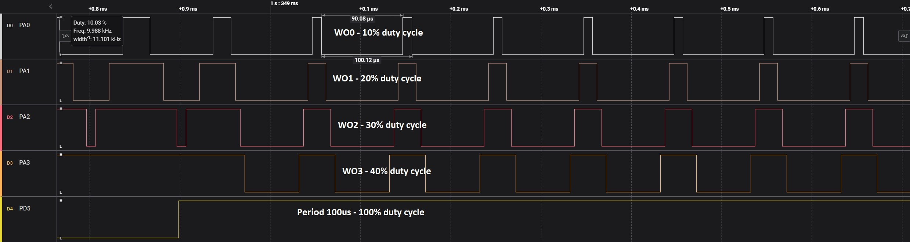
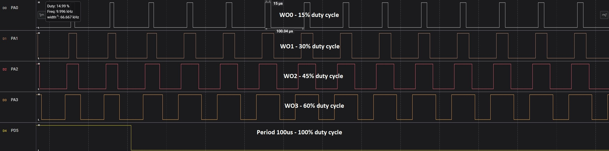
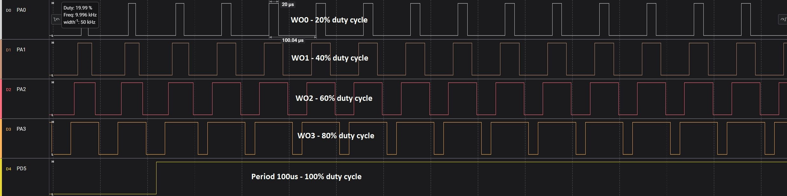
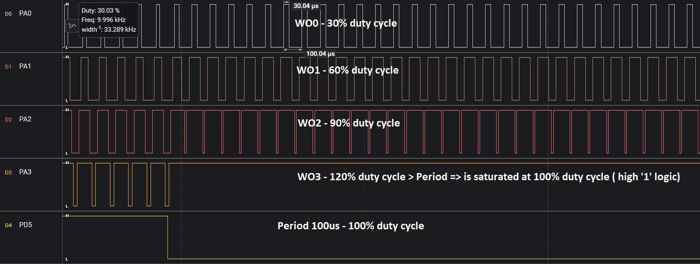

[](https://www.microchip.com)

## Generate PWM Signals Using TCE

Below is an example of how to set a Timer/Counter Type E (TCE) instance to generate four Pulse-Width Modulation (PWM) signals at 10 kHz with a 20%, 40%, 60% and 80% duty cycles. In this example the scaling feature of the values set in compare registers is highlighted, as well as the high resolution feature. The user can increase the PWM signal resolution up to 3 bits.

## Related Documentation

More details and code examples on the AVR16EB32 can be found at the following links:

- [AVR<sup>®</sup> EB Product Page](https://www.microchip.com/en-us/product/AVR16EB32)
- [AVR<sup>®</sup> EB Code Examples on GitHub](https://github.com/microchip-pic-avr-examples?q=AVR16EB32)

## Software Used

- [MPLAB® X IDE v6.15 or newer](https://www.microchip.com/en-us/tools-resources/develop/mplab-x-ide)
- [AVR-Ex DFP-2.7.184 or newer Device Pack](https://packs.download.microchip.com/)
- [MPLAB® XC8 compiler v2.45](https://www.microchip.com/en-us/tools-resources/develop/mplab-xc-compilers/downloads-documentation#XC8)

## Hardware Used

- [AVR<sup>®</sup> EB Curiosity Nano](https://www.microchip.com/en-us/product/AVR16EB32)

## Setup

The AVR16EB32 Curiosity Nano Development Board is used as a test platform.

<br>

## Functionality

<br>After the peripheral clock, the output port pins and TCE are initialized, the  ```Amplitude_Value_Set``` function is called in an infinite loop. This function changes the value written in the AMP register. Based on this value, the values that are initially written in the CMPBUF registers of TCE are scaled in hardware. TCE has a scaling hardware accelerator that modifies the values from CMPBUF registers based on the scale mode and the values from AMP and OFFSET registers. In this application, the amplitude is changed so the maximum duty cycle possible has the following values: 50%, 75%, 100% and 150%.

<br>For example, when the amplitude is set so that the maximum duty cycle is 50%, the initial value from CMP0BUF of 20% duty cycle gets scaled to 10%, the initial value from CMP1BUF of 40% duty cycle gets scaled to 20%, the initial value from CMP2BUF of 60% duty cycle gets scaled to 30%, and the initial value from CMP3BUF of 80% duty cycle gets scaled to 40%. An important thing to note is that if the scaled duty cycle is higher than 100%, it will be saturated at 100%, meaning the output pin of TCE will stay in logic '1' high.

<br>The values in CMPBUF registers must be rewritten for the amplitude change to take place. To be able to see the changes on a logic analyzer a toggle pin is used at the end of the function. High resolution is also enabled and set to 4X, which means that one peripheral clock cycle duration get shortened 4 times. For example, a 20MHz clock speed one clock cycle duration is 50ns. With the high resolution enabled one clock cycle duration will be approximate 12.5 ns.

## Function Called in an Infinite Loop

```c
void Amplitude_Value_Set(uint16_t value)
{
    /* Set the value of amplitude */
    TCE0.AMP = value;
    
    /* Rewrite the value in CMP0BUF register so that the duty cycle get scaled according to the new value of amplitude */
    TCE0.CMP0BUF = DUTY_CYCLE_20_PERCENT;
    
    /* Rewrite the value in CMP1BUF register so that the duty cycle get scaled according to the new value of amplitude */
    TCE0.CMP1BUF = DUTY_CYCLE_40_PERCENT;
    
    /* Rewrite the value in CMP2BUF register so that the duty cycle get scaled according to the new value of amplitude */
    TCE0.CMP2BUF = DUTY_CYCLE_60_PERCENT;
    
    /* Rewrite the value in CMP3BUF register so that the duty cycle get scaled according to the new value of amplitude */
    TCE0.CMP3BUF = DUTY_CYCLE_80_PERCENT;
    
    /* Toggle that signals when the value of amplitude has changed */
    PORTD.OUTTGL = PIN5_bm;
}
```

<br>


 ## Operation
 
 1. Connect the board to the PC.

 2. Open the **TCE_DS_4PWM_Signals.X** solution in MPLAB X IDE.

 3. Right click on the project and select **Set as main project**.

<br>

 4. Build the **TCE_DS_4PWM_Signals.X** project: click on **Clean and Build Project**.

<br>

 5. Program the project to the board: click on **Make and Program Device**.

<br>

## Results

Below are illustrations of logic analyzer captures to help understand how the 4 PWM signals look, and how the scaling of the duty cycles are made using the amplitude and offset:


<br>The range of the duty cycles is 0-50% of the PERIOD 
<br>

<br>The range of the duty cycles is scaled to 0-75% of the PERIOD
<br>

<br>The range of the duty cycles is scaled to 0-100% of the PERIOD
<br>

<br>The range of the duty cycles is scaled to 0-150% of the PERIOD
<br>


## Summary

This project shows how to use the TCE to generate PWM signals in dual ramp mode and how to use the high resolution and scaling mode of PWM duty cycle, depending on the set amplitude and offset.