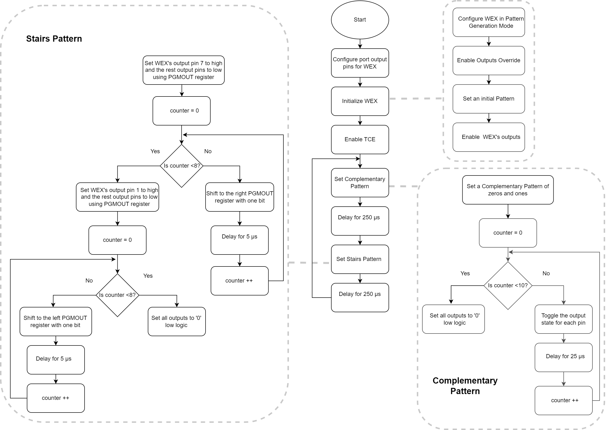
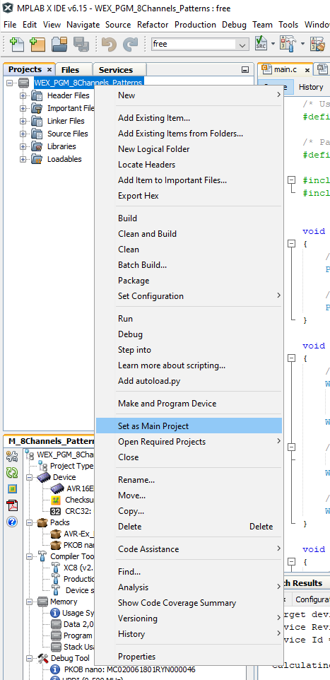
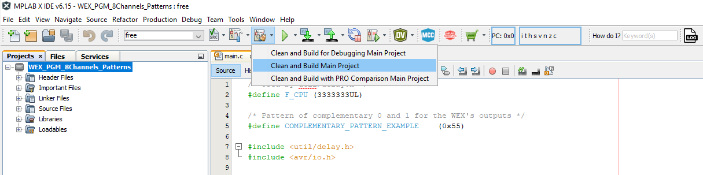
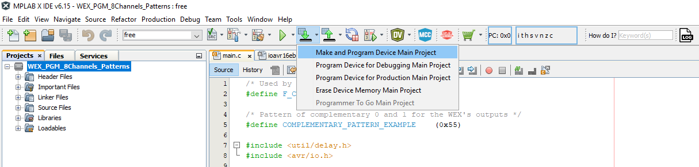
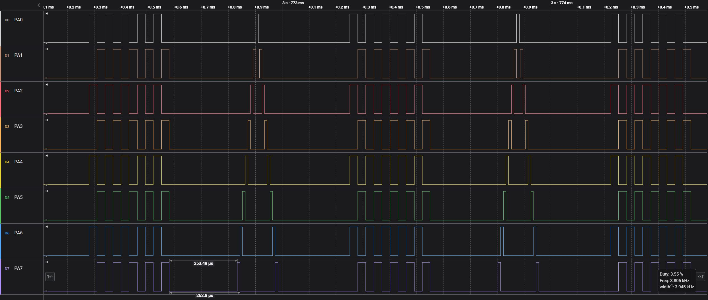

[](https://www.microchip.com)

## Generate Patterns Using WEX

This use case shows how the TCE’s waveform extension is configured to set a pattern for the output signals that changes periodically. The program will toggle the pins (complementary pattern) every 25 μs using software delay for ten times. After another 250 μs a stair-like pattern will be generated, with 5 μs delay between each step. After another 250 μs delay, the process repeats.

## Related Documentation

- [AVR<sup>®</sup> EB Product Page](https://www.microchip.com/en-us/product/AVR16EB32)
- [AVR<sup>®</sup> EB Code Examples on GitHub](https://github.com/microchip-pic-avr-examples?q=AVR16EB32)

## Software Used

- [MPLAB® X IDE v6.15 or newer](https://www.microchip.com/en-us/tools-resources/develop/mplab-x-ide)
- [AVR-Ex DFP-2.7.184 or newer Device Pack](https://packs.download.microchip.com/)
- [MPLAB® XC8 compiler v2.45](https://www.microchip.com/en-us/tools-resources/develop/mplab-xc-compilers/downloads-documentation#XC8)

## Hardware Used

- [AVR<sup>®</sup> EB Curiosity Nano](https://www.microchip.com/en-us/product/AVR16EB32)

## Setup

The AVR16EB32 Curiosity Nano Development Board is used as a test platform.

<br>

## Functionality

After the output port pins of the Waveform Extension (WEX) are configured, WEX is initialized, Timer Counter type E (TCE) is started, the ```Complementary_Pattern_Set``` and ```Stairs_Pattern_Set``` functions are called in an infinite loop. These functions change the output port pins state by overriding the current state with a new one. The update condition is done in software using delays. The WEX is configured in Pattern Generation Mode to be able to override the port pins outputs. The first function is used to generate a complementary pattern of 0 and 1 for the eight output signals of WEX. After a 250 μs delay the second function is called and a stairs pattern is generated. After another 250 μs delay the process repeats in an infinite loop.

## Functions Called in an Infinite Loop

```c
void Complementary_Pattern_Set(void)
{
    WEX0.PGMOUT = COMPLEMENTARY_PATTERN_EXAMPLE;
        
    _delay_us(25);

    /* Complementary signals pattern */
    for(uint8_t i = 0; i < 9; i++)
    {    
        /* Toggle the pattern for each of the WEX's output */
        WEX0.PGMOUT = ~WEX0.PGMOUT;
        /* Software delay added in order for the toggle to be visible */
        _delay_us(25);
    }

    /* Put all signals in low '0' logic and wait 1ms to see the transition from one of the 
     * complementary patterns to the stairs pattern*/
    WEX0.PGMOUT = 0x00;
}

void Stairs_Pattern_Set(void)
{
    /* Each of the signals switch from low to high one at a time in increasing order*/
    WEX0.PGMOUT = WEX_PGMOUT7_bm;
    for(uint8_t step = 0; step < 8; step ++)
    {
        /* Software delay added in order for the increment to be visible */
        _delay_us(5);
        /* Generate a stairs increment pattern*/
        WEX0.PGMOUT = WEX0.PGMOUT>>1;
    }

    /* Each of the signals switch from low to high one at a time in increasing order*/
    WEX0.PGMOUT = WEX_PGMOUT1_bm;
    for(uint8_t step = 0; step < 8; step ++)
    {
        /* Software delay added in order for the increment to be visible */
        _delay_us(5);
        /* Generate a stairs decrement pattern*/
        WEX0.PGMOUT = WEX0.PGMOUT<<1;
    }

    /* Put all signals in low '0' logic and wait 1ms to see the transition from the 
     * stairs pattern to one of the complementary patterns*/
    WEX0.PGMOUT = 0x00;
}
```

<br>

## Operation

 1. Connect the board to the PC.

 2. Open the **WEX_PGM_8Channels_Patterns.X** solution in MPLAB X IDE.

 3. Right click on the project and select **Set as main project**.

<br>

 4. Build the **WEX_PGM_8Channels_Patterns.X** project: click on **Clean and Build Project**.

<br>

 5. Program the project to the board: click on **Make and Program Device**.

<br>

## Results

Below is illustrated a logic analyzer capture, to help understanding a little bit better how to override the port pins and take the pins control from TCE using the WEX module:

<br>Switching from an alternating '1', '0' logic pattern to a staircase patern, using all the possible outputs.

<br>

## Summary

This project shows how to use the WEX to generate different patterns, and take control of the TCE pins during run time, without stopping the timer. This is extremely useful for applications like for e.g. trapezoidal motor control, where some PWM signals must be forced to low '0' logic depending on the commutation sector.